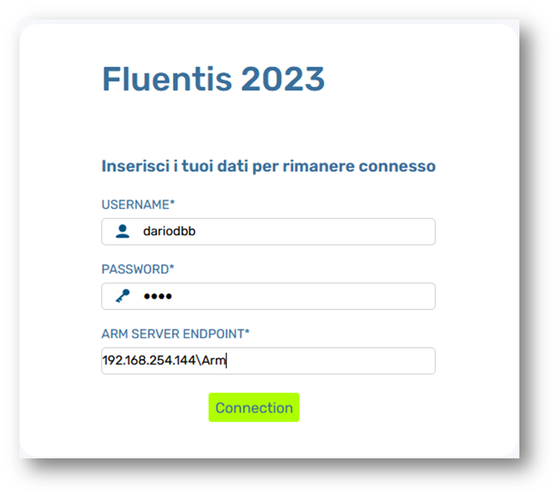

>  You can run Fluentis Web by different Operative Systems such as: **MacOs**, **Linux Distros**, **Microsoft Windows**.
> 
### Minimum requirements:
>**Server**
- Separate Virtual Machine for Web Cluster  
  - 16 GB RAM with (minimum) 3GB per user  
  
>**Client**
- Mozilla Firefox latest version  


You can download latest version of Mozilla Firefox Browser by Link Below:

```
https://www.mozilla.org/it/firefox/new/
```