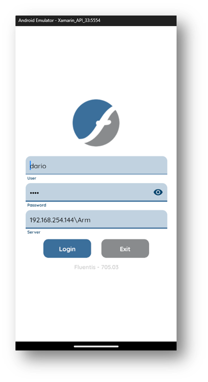

>  You can run Fluentis Mobile in Android

### Minimum requirements:
**Server**
- The same of Wpf Installation

**Client**
- Android (min version 5.1 cod. Lollipop)  


You can download latest version of Fluentis Mobile Client by Link Below:

```
https://cdn.fluentis.com/products/Fluentis2023/705/Xamarin/
```


