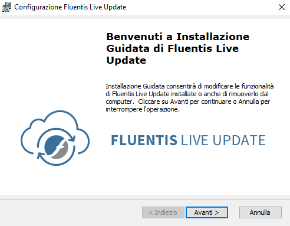

:::info
In the Windows Server environment, installation of the Fluentis Installer Service and the Fluentis Live Update Web application with its database is done contextually.  
:::

## Scenario 1 - Single Server Installation

1. From ***cdn.fluentis.com/products*** you need to download the installation package **FluentisLiveUpdate_1.2.70.msi** and run it.

2. Press Next, and accept the license terms.

3. For a **Single Server Installation** (application part + database part) choose the full type installation.

4. Indicate **MSSQL database engine instance** with user -sa and its password and **Windows server administrator** user with its password. Leave FluentisLiveUpdateUser with its password as it is proposed by the system. 

The wizard will install:
* the FluentisLiveUpdate database in the indicated MSSQL instance;
* the Web App with associated application pool in IIS;
* a desktop shortcut to launch the Web App.

## Scenario 2 - Multiple Server Installation

In this scenario, there are two servers involved in the installation:
* a server for the MSSQL database engine instance;
* one server for the application part.

:::danger warining
Each server involved in the installation of Fluentis must have the Fluentis Installer Service installed.  
Fluentis Installer must be launched in **both servers**.
:::

1. From ***cdn.fluentis.com/products*** you need to download the installation package **FluentisLiveUpdate_1.2.70.msi** and run it.

2. Press Next, and accept the license terms.

3. For a **Multiple Server Installation** (MSSQL) choose the custom installation.

4. In the MSSQL database server, uncheck the WebSite and continue the installation.

5. In the Fluentis application server uncheck database and continue the installation.

