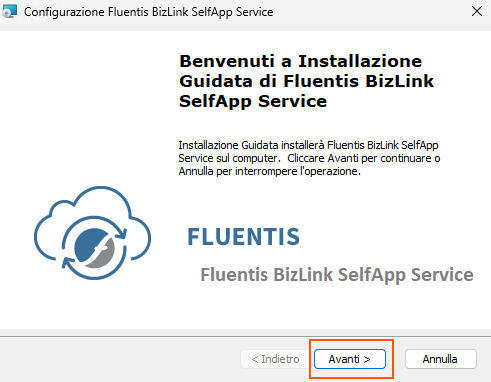
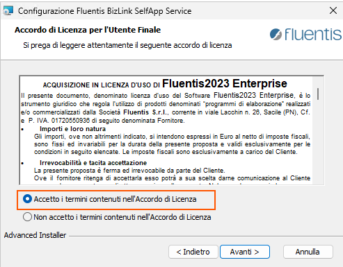
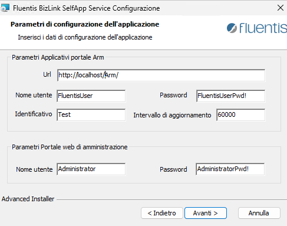

### BizLink installation on Windows Server
Per l'installazione del servizio di BizLink su Server Windows è necessario scaricare il relativo installer dal cdn ufficiale Fluentis al seguente link

```bash
https://cdn.fluentis.com/products/Fluentis2023/Fluentis2023BizLinkSelfAppService_3.06.msi
```

Una volta avviato il file eseguibile, un wizard d'installazione guiderà l'utente lungo il processo d'installazione del servizio.  



Accettare i termini di licenza.  



Configurare i parametri relativi al servizio di BizLink



* Url: rappresenta l'endpoint completo del server Arm.
* Username: rappresenta l'utente di Supervisor parametrizzato in Arm.  
* Password: rappresenta la password relativa all'utente di cui sopra.
* Identificativo: rappresenta l'identificativo del servizio di BizLink.
* Pooling: rappresenta il tempo, espresso in millisecondi, con il quale il servizio di BizLink interroga in server Arm.  
* Username: rappresenta il nome utente da utilizzare per fare il login nella WebApp.
* Password: rappresenta la password relativa all'utente di cui sopra.  

### BizLink update on Windows Server

Per aggiornare il servizio è necessario disinstallare il servizio già esistente per poi procedere all'installazione mediante il nuovo kit reperibile al cdn Fluentis.   

### BizLink installation on Linux (Docker)
Per l'installazione del servizio di BizLink in ambiente Linux con Docker 


### BizLink update on Linux (Docker)