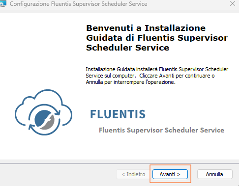
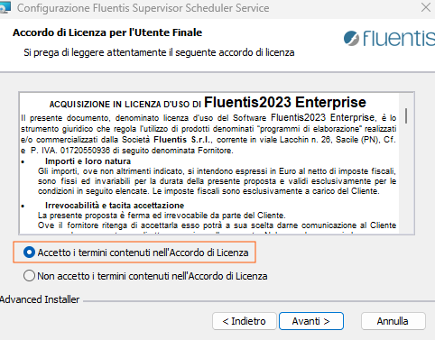
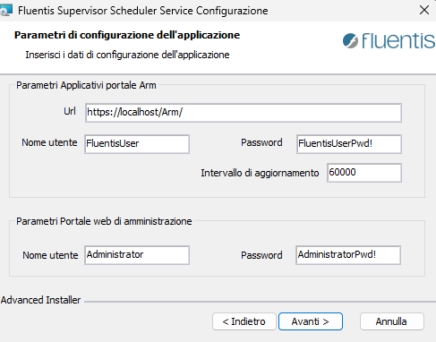
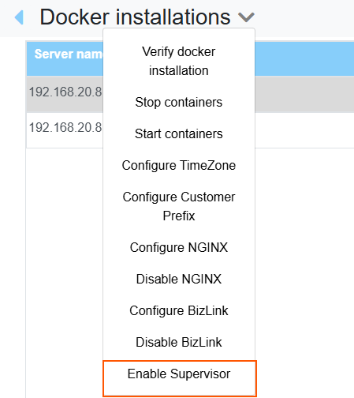
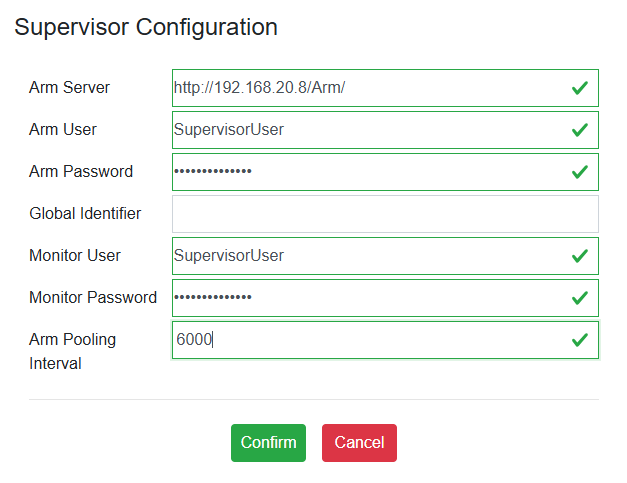
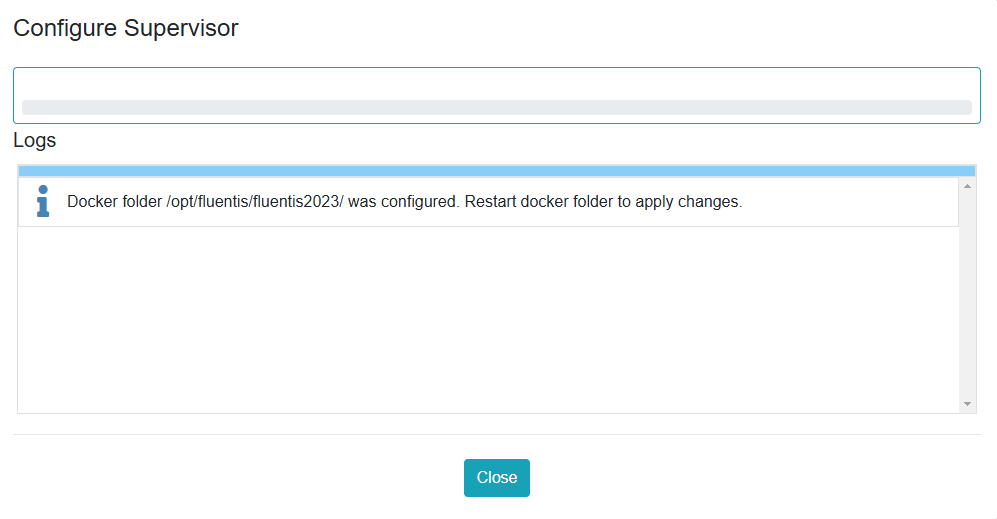
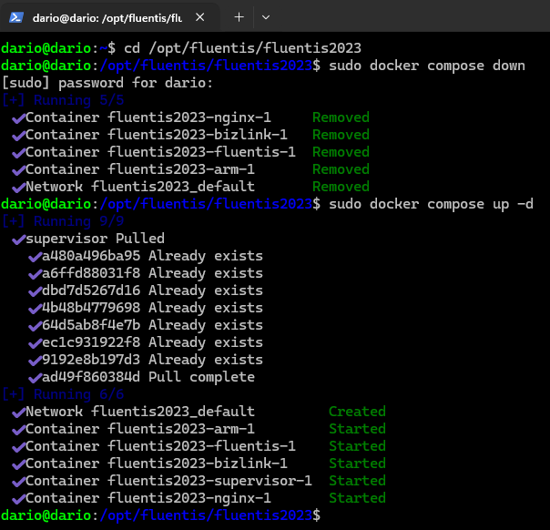
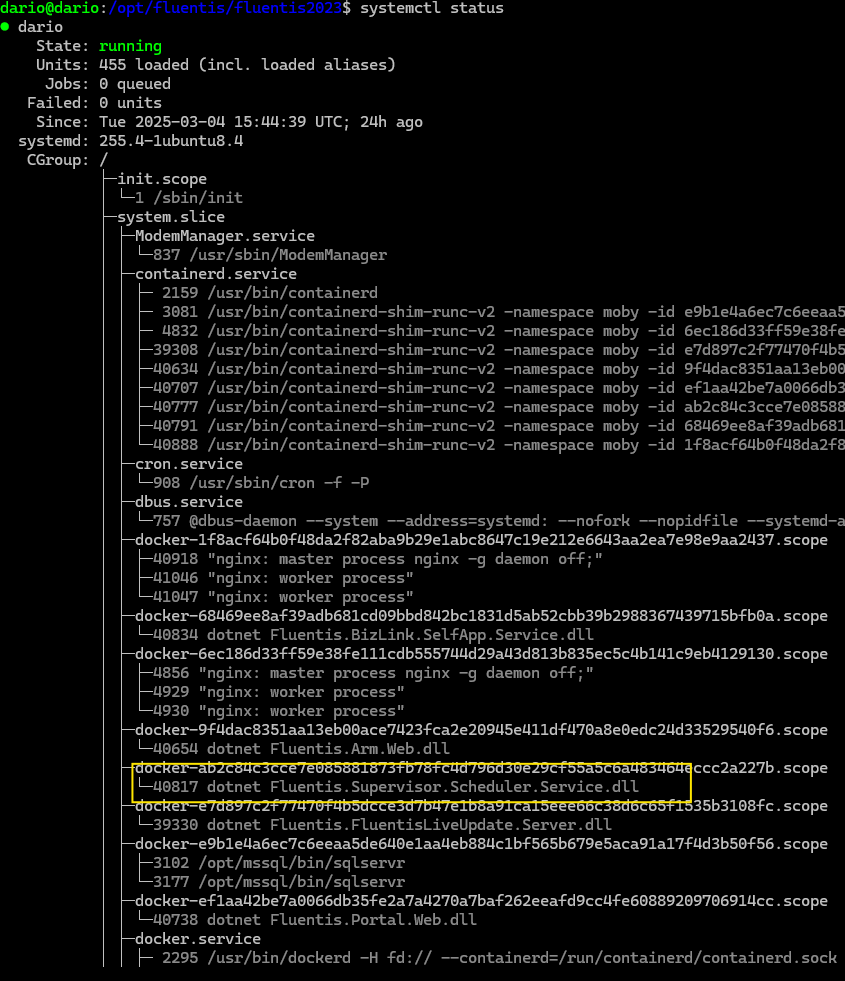
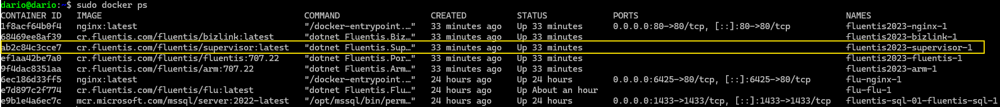
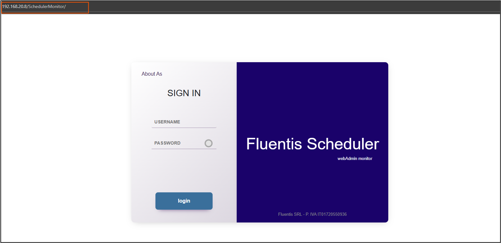

### Supervisor Installation on Windows Server 
On a Windows Server environment, you can install the Supervisor service using an executable file, which can be downloaded via a browser from the following link:
```bash
https://cdn.fluentis.com/products/Fluentis2023/Fluentis2023SupervisorSchedulerService_3.02.msi
```



Accept the license terms.  



On this screen, you need to configure the installation parameters.  



* Url: It is the full endpoint of the Arm server. The endpoint consists of:  
  * Communication protocol: http or https for SSL certificate-secured connections.  
  * Hostname: This is either the server's IP address or the private (or public) domain name if a DNS server is available.  
  * URL: This is the Arm endpoint.  
* Username: This is the Supervisor user to be configured in Arm.  
* Password: This is the password associated with the user mentioned above.     
* Username: This is the user used to log in to the web application dedicated to Supervisor.  
* Password: This is the password associated with the user mentioned above.  

Once the parameters above are set, the service installation will begin, and it will be operational immediately.  

### Supervisor Update on Windows Server
In a Windows Server environment, to proceed with updating the scheduling service, you need to:  
* Uninstall the existing scheduling service.  
* Install the new scheduling service using the procedure described in the previous step.  


### Supervisor Installation on Linux Docker Server
To install the Supervisor service in a GNU/Linux-based environment with Docker, you need to connect to Fluentis Live Update to proceed with the installation of the scheduling service.   

From Fluentis Live Update, go to the Docker Installations section. After selecting the record related to the Fluentis application component, click on the Docker Installations dropdown as shown in the image.  



By clicking on Enable Supervisor, a popup will appear that allows you to configure the scheduling service.  




* Arm Server: Enter the full endpoint of the Arm server.    
* Arm User: Enter the username of the Supervisor user configured in Arm.  
* Arm Password: Enter the password associated with the user mentioned above.     
* Monitor User: Enter the username of the Supervisor user for the Supervisor web application.  
* Monitor Password: Enter the password associated with the user mentioned above.    
* Arm pooling interval: Enter the update time in milliseconds for the service data. For example, if you set it to 6 seconds (6000ms), the web application will make a call to the Arm server every 6 seconds to receive the data.  



Once confirmed, a popup will appear notifying you that, to complete the installation, you will need to recreate the containers using these commands.  
```bash
sudo docker compose down
```
```bash
sudo docker compose up -d
```


The Docker image will be pulled automatically.  
**The service is correctly installed and operational.**  
To check the status of the service, we can use the well-known systemctl command.
```bash
sudo systemctl status
```



Alternatively, you can simply use the docker commands to check the running status of the containers.  

```bash
sudo docker ps
```



### Supervisor Update on Linux Docker Server
To update the scheduling service in a Linux (Docker) environment, it is sufficient to recreate the containers.  
```bash
sudo docker compose down
```
```bash
sudo docker compose up -d
```



