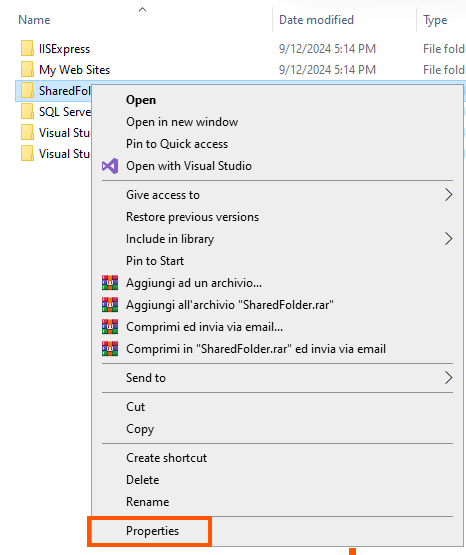
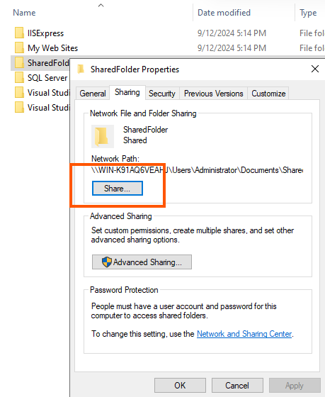
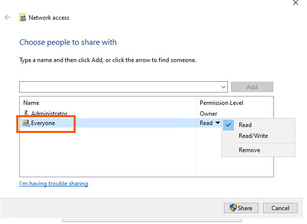
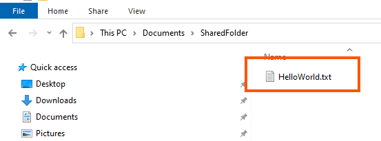
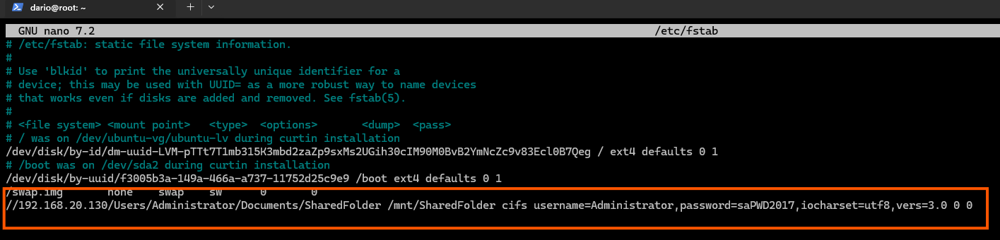
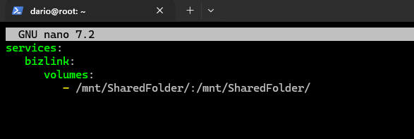
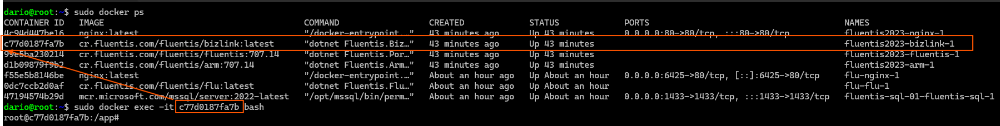
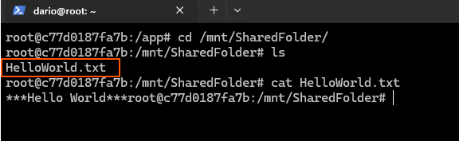

### Binding Windows Shared Folder in Linux (Ubuntu)

In an installation scenario involving installation of the Fluentis Suite on Linux (Docker), in order to save files from Fluentis to a shared folder on Windows servers, this guide must be followed.  

* First you need to enable folder sharing on the Windows Server.  

* Click Sharing Options.  

* Add ***Everyone***, and set the right permission.  


* In this example there is a txt file inside the folder called HelloWorld.txt.  


* Access via **SSH protocol** to the Linux server and create the same folder in the absolute path /mnt/   

```bash
sudo mkdir /mnt/SharedFolder
```

* edit the fstab file and add the path relative to the folder in the shared Windows server.  
```bash
sudo nano /etc/fstab
```


* execute the following command  
```bash
sudo mount -a
```
* Now reload the daemon
```bash
sudo systemctl daemon-reload
```

* Now the **HelloWorld.txt** file will be visible within the Linux server. 


### Binding Windows Shared Folder in Linux (Docker)

**To share the same folder within a Docker container, these basic steps must be followed.**

* Edit the file extra.yml in fluentis folder installation.  
```bash
sudo nano /opt/fluentis/fluentis2023/extra.yml
```
* Add the service and folder to be mounted on Docker. In this example, we mount the folder on the container related to BizLink.  



:::danger CAUTION
**PAY ATTENTION TO THE CODE INDENTATION REQUIRED BY THE .YML FILES**
:::

* Stop and Start the containers.  
```bash
sudo docker compose down
```
```bash
sudo docker compose up -d
```
:::danger CAUTION
**YOU MUST BE ON THE PATH /opt/fluentis/fluentis2023 to run the docker compose commands.**
:::

* Now we see the folder inside the container we mapped.  

```bash
sudo docker exec -it IdOfTheContainer bash 
```




