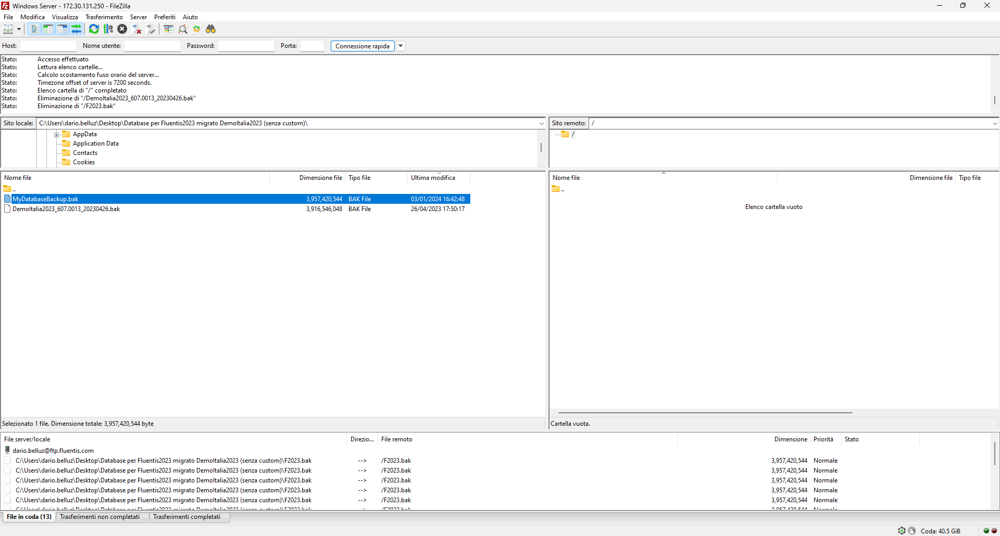
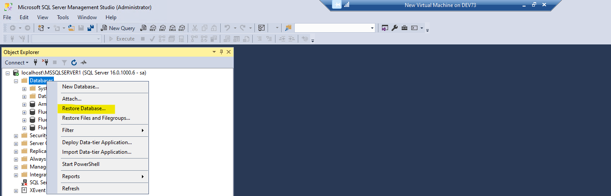

### Prerequisites
* Make sure you have an instance of **SQL Server** engine into Windows Server.
* Make sure you have the database backup file (.bak file) you want to restore.
* Make sure you have the **FTP Daemon** installed in your Server.
* Make sure you have the **FTP Client** installed in your local computer.

### How it works
By the **FTP Client** connect to Windows Server and upload the backup file from local to remote machine.  
Drag and Drop the target file from local to remote machine.

You can restore the database backup into SQL Server Engine instance by **SSMS** selecting main node, and right-click **restore database**.

Then, you can browsing Windows Server FileSystem and you can select the backup of database you want restore.